# Sơ Đồ Kiến Trúc Hệ Thống IoT Smart Home

> **Tổng quan:** Hệ thống IoT Smart Home gồm 3 tầng chính: **Mobile App** (React Native/Expo), **AWS Cloud** (IoT Core + Lambda + DynamoDB + InfluxDB), và **Edge Devices** (ESP32 Sensor + Switch).

---

## Kiến Trúc Toàn Hệ Thống

```mermaid
graph TB
    subgraph MOBILE["📱 Mobile App (React Native / Expo)"]
        direction TB
        APP_UI["UI Screens\n(Dashboard, DeviceControl,\nMonitoring, Scenes, AddDevice)"]
        SVC_API["api.js\n(REST calls via Cognito JWT)"]
        SVC_BLE["ble.js\n(react-native-ble-plx)"]
        SVC_AUTH["auth.js\n(AWS Amplify / Cognito)"]
        APP_UI --> SVC_API
        APP_UI --> SVC_BLE
        APP_UI --> SVC_AUTH
    end

    subgraph AWS_AUTH["🔐 Auth Layer"]
        COGNITO["AWS Cognito\nUser Pool\n(SignUp / Login / JWT)"]
    end

    subgraph AWS_API["🌐 API Layer"]
        APIGW["API Gateway REST\n/v1/{proxy+}\n(Cognito Authorizer)"]
        LAMBDA_API["Lambda: api\n(handler.js)\nRoutes: /devices, /scenes,\n/ota, /admin/claims"]
    end

    subgraph AWS_IOT["☁️ AWS IoT Core"]
        IOT_BROKER["MQTT Broker\n(mqtts port 8883)\nTLS mTLS"]
        IOT_REGISTRY["Thing Registry\n(switch-*, sensor-*)"]
        IOT_SHADOW["Device Shadow\n($aws/things/{id}/shadow/*)"]
        IOT_JOBS["IoT Jobs\n($aws/things/{id}/jobs/*)"]
        FLEET_PROV["Fleet Provisioning\n($aws/certificates/create/json)\n($aws/provisioning-templates/{tpl}/provision/json)"]
        RULE_TELEMETRY["Topic Rule:\ndevices/+/telemetry\n→ Lambda IoT Processor"]
        RULE_STATUS["Topic Rule:\ndevices/+/status\n→ DynamoDB"]
        RULE_ALERT["Topic Rule:\ntemperature>35 OR humidity>80\n→ Lambda IoT Processor"]
    end

    subgraph AWS_LAMBDA["⚡ Lambda Functions"]
        LAMBDA_PROV_HOOK["Lambda: provisioning-hook\n(Pre-Provisioning Hook)\nValidate claimId in DynamoDB"]
        LAMBDA_IOT_PROC["Lambda: iot-processor\n(IoT Processor)\nInfluxDB write + DynamoDB update + SNS"]
        LAMBDA_SCENE["Lambda: scene-engine\n(Scene Engine)\nExecute scenes via Shadow Update"]
        LAMBDA_OTA["Lambda: ota-manager\n(OTA Manager)\nS3 presign + IoT Jobs create"]
    end

    subgraph AWS_DATA["🗄️ Data Layer"]
        DDB_DEVICES["DynamoDB: devices\n(deviceId PK)\nDevice registry + last-seen"]
        DDB_CLAIMS["DynamoDB: device-claims\n(claimId PK, TTL)\nProvisioning tokens"]
        DDB_USER_DEV["DynamoDB: user-device\n(userId PK + deviceId SK)\nOwnership mapping"]
        DDB_SCENES["DynamoDB: scenes\n(userId PK + sceneId SK)\nAutomation rules"]
        DDB_OTA["DynamoDB: ota-jobs\n(jobId PK)\nOTA job tracking"]
        INFLUXDB["InfluxDB (EC2/ECS)\nTime-series telemetry\n(temperature, humidity)"]
        S3_FW["S3: firmware bucket\nfirmware/{type}/v{ver}/firmware.bin"]
    end

    subgraph AWS_NOTIFY["🔔 Notification"]
        SNS["AWS SNS\niot-alerts topic\n→ Email alerts"]
        EVENTBRIDGE["EventBridge\ncron(0 15 * * ? *)\nNightly Scene @ 22:00 UTC+7"]
    end

    subgraph DEVICES["🔌 Edge Devices (ESP32 + FreeRTOS)"]
        direction LR
        subgraph SENSOR["DHT11 Sensor"]
            S_MAIN["main.c\n(app_main)"]
            S_PROV["provisioning.c\n(Fleet Provisioning)"]
            S_BLE_PROV["ble_provisioning.c\n(NimBLE GATT Server)"]
            S_MQTT["iot_mqtt_client.c\n(mqtts + mTLS)"]
            S_SHADOW["shadow_handler.c\n(report state)"]
            S_OTA["ota_handler.c\n(esp_https_ota)"]
            S_DHT["dht11_driver.c\n(GPIO read)"]
        end
        subgraph SWITCH["Light Switch"]
            W_MAIN["main.c\n(app_main)"]
            W_PROV["provisioning.c\n(Fleet Provisioning)"]
            W_BLE_PROV["ble_provisioning.c\n(NimBLE GATT Server)"]
            W_MQTT["mqtt_client.c\n(mqtts + mTLS)"]
            W_SHADOW["shadow_handler.c\n(relay control)"]
            W_OTA["ota_handler.c\n(esp_https_ota)"]
            W_RELAY["relay_control.c\n(GPIO relay)"]
        end
    end

    %% Mobile → Auth
    SVC_AUTH <-->|"SignUp / SignIn\nJWT Token"| COGNITO

    %% Mobile → API Gateway
    SVC_API <-->|"HTTPS + JWT Bearer"| APIGW
    APIGW --> LAMBDA_API

    %% API → IoT Core (Shadow update / shadow get)
    LAMBDA_API <-->|"UpdateThingShadow\nGetThingShadow"| IOT_SHADOW
    LAMBDA_API <-->|"CreateProvisioningClaim\n(Trusted User)"| FLEET_PROV
    LAMBDA_API -->|"CreateJob"| IOT_JOBS
    LAMBDA_API <-->|"R/W"| DDB_CLAIMS
    LAMBDA_API <-->|"R/W"| DDB_DEVICES
    LAMBDA_API <-->|"R/W"| DDB_USER_DEV
    LAMBDA_API <-->|"R/W"| DDB_SCENES
    LAMBDA_API <-->|"Query"| INFLUXDB
    LAMBDA_API -->|"InvokeAsync"| LAMBDA_SCENE

    %% Mobile → BLE (direct, local)
    SVC_BLE <-->|"BLE GATT\n(NimBLE)\nJSON payload chunks"| S_BLE_PROV
    SVC_BLE <-->|"BLE GATT\n(NimBLE)\nJSON payload chunks"| W_BLE_PROV

    %% IoT Core ↔ Devices (MQTT mTLS)
    IOT_BROKER <-->|"mqtts:8883\nmTLS (device cert)"| S_MQTT
    IOT_BROKER <-->|"mqtts:8883\nmTLS (device cert)"| W_MQTT

    %% IoT Core internal
    IOT_BROKER --> RULE_TELEMETRY
    IOT_BROKER --> RULE_STATUS
    IOT_BROKER --> RULE_ALERT
    IOT_SHADOW <--> IOT_BROKER
    IOT_JOBS <--> IOT_BROKER
    FLEET_PROV --> LAMBDA_PROV_HOOK

    %% Rules → Lambda / DynamoDB
    RULE_TELEMETRY --> LAMBDA_IOT_PROC
    RULE_ALERT --> LAMBDA_IOT_PROC
    RULE_STATUS -->|"PutItem"| DDB_DEVICES

    %% Lambda Processor
    LAMBDA_IOT_PROC -->|"Write points"| INFLUXDB
    LAMBDA_IOT_PROC -->|"UpdateItem\n(lastSeen)"| DDB_DEVICES
    LAMBDA_IOT_PROC -->|"Publish alert"| SNS

    %% Provisioning Hook → DynamoDB
    LAMBDA_PROV_HOOK <-->|"Validate + Write"| DDB_CLAIMS
    LAMBDA_PROV_HOOK -->|"PutItem"| DDB_DEVICES
    LAMBDA_PROV_HOOK -->|"PutItem"| DDB_USER_DEV

    %% Scene Engine
    EVENTBRIDGE -->|"schedule trigger"| LAMBDA_SCENE
    LAMBDA_SCENE <-->|"Query scenes"| DDB_SCENES
    LAMBDA_SCENE -->|"UpdateThingShadow\n(desired state)"| IOT_SHADOW

    %% OTA Manager
    LAMBDA_OTA <-->|"HeadObject / GetSignedUrl"| S3_FW
    LAMBDA_OTA -->|"CreateJob"| IOT_JOBS
    LAMBDA_OTA -->|"PutItem"| DDB_OTA

    %% Jobs → Device OTA
    IOT_JOBS -->|"Job notification"| S_OTA
    IOT_JOBS -->|"Job notification"| W_OTA
    S_OTA -->|"HTTPS GET firmware.bin"| S3_FW
    W_OTA -->|"HTTPS GET firmware.bin"| S3_FW

    %% Fleet Provisioning flow (device side)
    FLEET_PROV <-->|"CreateKeysAndCertificate\nRegisterThing"| S_PROV
    FLEET_PROV <-->|"CreateKeysAndCertificate\nRegisterThing"| W_PROV

    %% Styling
    classDef mobile fill:#4A90D9,stroke:#2C6FAC,color:#fff
    classDef aws fill:#FF9900,stroke:#C77A00,color:#fff
    classDef iot fill:#1A73E8,stroke:#1557B0,color:#fff
    classDef lambda fill:#F0A500,stroke:#C88A00,color:#fff
    classDef data fill:#34A853,stroke:#267A3F,color:#fff
    classDef device fill:#7B1FA2,stroke:#4A148C,color:#fff
    classDef notify fill:#EA4335,stroke:#C5221F,color:#fff

    class APP_UI,SVC_API,SVC_BLE,SVC_AUTH mobile
    class COGNITO,APIGW aws
    class IOT_BROKER,IOT_REGISTRY,IOT_SHADOW,IOT_JOBS,FLEET_PROV,RULE_TELEMETRY,RULE_STATUS,RULE_ALERT iot
    class LAMBDA_API,LAMBDA_PROV_HOOK,LAMBDA_IOT_PROC,LAMBDA_SCENE,LAMBDA_OTA lambda
    class DDB_DEVICES,DDB_CLAIMS,DDB_USER_DEV,DDB_SCENES,DDB_OTA,INFLUXDB,S3_FW data
    class S_MAIN,S_PROV,S_BLE_PROV,S_MQTT,S_SHADOW,S_OTA,S_DHT,W_MAIN,W_PROV,W_BLE_PROV,W_MQTT,W_SHADOW,W_OTA,W_RELAY device
    class SNS,EVENTBRIDGE notify
```

---

## Mô Tả Các Tầng

| Tầng | Công nghệ | Vai trò |
|------|-----------|---------|
| **Mobile App** | React Native + Expo + Amplify | UI điều khiển, BLE provisioning, REST API calls |
| **Auth** | AWS Cognito | Đăng ký/đăng nhập, phát JWT ID Token |
| **API Gateway** | AWS API Gateway REST | Nhận request từ app, xác thực JWT Cognito |
| **API Lambda** | Node.js 20.x | Router xử lý toàn bộ REST routes |
| **IoT Core** | AWS IoT Core (MQTT broker) | Hub trung tâm kết nối device ↔ cloud |
| **Fleet Provisioning** | AWS IoT Fleet Provisioning | Tự động đăng ký device, cấp cert vĩnh cửu |
| **Provisioning Hook** | Lambda Node.js | Validate claimId trước khi cấp cert |
| **IoT Processor** | Lambda Node.js | Xử lý telemetry, ghi InfluxDB, cảnh báo SNS |
| **Scene Engine** | Lambda Node.js | Thực thi automation scenes |
| **OTA Manager** | Lambda Node.js | Tạo IoT Jobs, presign S3 URL |
| **DynamoDB** | 5 bảng | Devices, Claims, User-Device mapping, Scenes, OTA Jobs |
| **InfluxDB** | InfluxDB (EC2/ECS) | Time-series cho telemetry nhiệt độ/độ ẩm |
| **S3** | firmware bucket | Lưu trữ firmware binary cho OTA |
| **SNS** | AWS SNS | Alert email khi nhiệt độ/độ ẩm vượt ngưỡng |
| **EventBridge** | Cron rule | Kích hoạt Scene Engine theo lịch (22:00 UTC+7) |
| **ESP32 Sensor** | ESP-IDF + FreeRTOS | Đọc DHT11, publish MQTT, nhận OTA |
| **ESP32 Switch** | ESP-IDF + FreeRTOS | Điều khiển relay, nhận Shadow delta |

---

## Các Luồng Chính

| # | Luồng | File |
|---|-------|------|
| 03 | Device Provisioning & Claiming | [03-provisioning-flow.md](./03-provisioning-flow.md) |
| 04 | Data Collection & Real-time Monitoring | [04-telemetry-monitoring-flow.md](./04-telemetry-monitoring-flow.md) |
| 05 | Remote Device Control (Shadow) | [05-remote-control-flow.md](./05-remote-control-flow.md) |
| 06 | Rule Engine & Smart Scene Automation | [06-scene-automation-flow.md](./06-scene-automation-flow.md) |
| 07 | OTA Firmware Update | [07-ota-flow.md](./07-ota-flow.md) |
