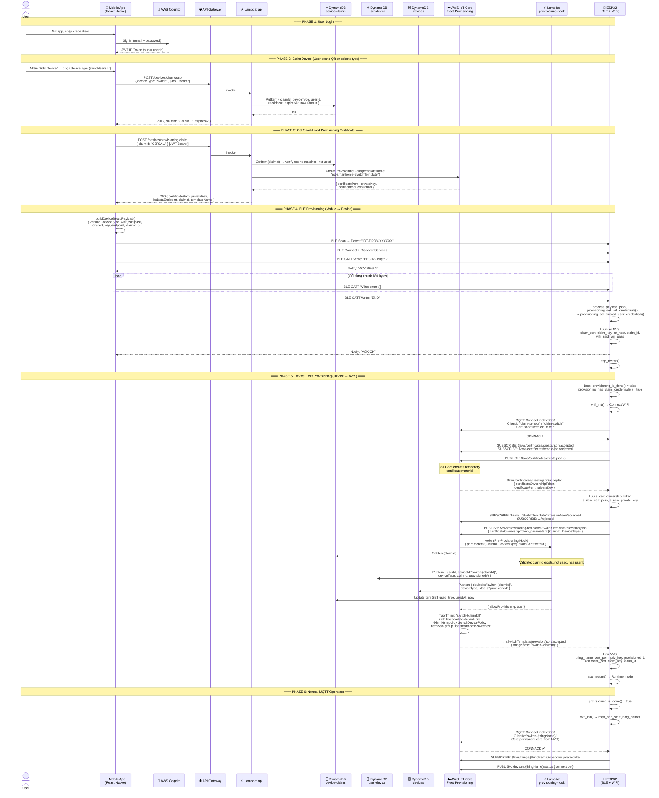

# Luồng 03: Device Provisioning & Claiming Mechanism

> **Mô tả:** Luồng đăng ký thiết bị mới từ lần đầu bật nguồn đến khi device kết nối thành công vào AWS IoT Core với certificate vĩnh cửu. Sử dụng mô hình **Trusted User Fleet Provisioning**.

---

## Tổng Quan Luồng

```
[User] → (Scan QR / chọn device type) → [Mobile App]
       → POST /devices/claim/auto hoặc /devices/claim
       → POST /devices/provisioning-claim (lấy short-lived cert)
       → BLE GATT → [ESP32 Device]
       → WiFi connect
       → MQTT Fleet Provisioning → [AWS IoT Core]
       → Lambda Pre-Provisioning Hook
       → Certificate + ThingName → Device NVS
       → MQTT normal operation
```

---

## Sequence Diagram



---

## Bảng Mô Tả Chi Tiết

| Bước | Actor | Action | Artifact |
|------|-------|--------|----------|
| 1 | User | Đăng nhập app | Cognito JWT |
| 2 | Mobile | POST `/devices/claim/auto` | `claimId` trong DynamoDB |
| 3 | Mobile | POST `/devices/provisioning-claim` | Short-lived cert (X.509) |
| 4 | Mobile→Device | BLE GATT Write (chunked JSON) | WiFi + cert lưu vào NVS |
| 5 | Device | MQTT Fleet Provisioning Step 1 | `certificateOwnershipToken` |
| 6 | Device | MQTT Fleet Provisioning Step 2 | Hook Lambda → Thing + policy |
| 7 | Hook | Validate claimId, write DB | `allowProvisioning: true` |
| 8 | Device | Lưu permanent cert vào NVS | `provisioned = 1` |
| 9 | Device | Restart → normal MQTT mode | Online thành công |

---

## NVS Storage Schema

```
Namespace: "iot_cfg"
┌─────────────────┬──────────────────────────────────────────────────────┐
│ Key             │ Value                                                │
├─────────────────┼──────────────────────────────────────────────────────┤
│ wifi_ssid       │ "MyHomeWifi"                                         │
│ wifi_pass       │ "password123"                                        │
│ iot_host        │ "a10xp7m81hk5fg-ats.iot.ap-southeast-1.amazonaws.com"│
│ claim_id        │ "C3F9A..." (xóa sau provisioning)                   │
│ claim_cert      │ PEM (short-lived, xóa sau provisioning)             │
│ claim_key       │ PEM (short-lived, xóa sau provisioning)             │
│ thing_name      │ "switch-C3F9A..." (sau provisioning)                │
│ cert_pem        │ PEM vĩnh cửu (sau provisioning)                     │
│ priv_key        │ PEM vĩnh cửu (sau provisioning)                     │
│ provisioned     │ 1 (uint8)                                            │
└─────────────────┴──────────────────────────────────────────────────────┘
```

---

## Source Code References

| File | Vai trò |
|------|---------|
| `mobile/src/services/ble.js` | BLE scan, connect, gửi payload chunks |
| `mobile/src/services/api.js` | `createAutoClaim()`, `createProvisioningClaim()` |
| `mobile/src/screens/AddDeviceScreen.jsx` | UI flow provisioning |
| `device/switch/src/ble_provisioning.c` | NimBLE GATT server, nhận payload |
| `device/switch/src/provisioning.c` | `provisioning_run()`, Fleet Provisioning MQTT |
| `device/switch/src/main.c` | Orchestration flow: BLE → WiFi → MQTT |
| `backend/functions/api/handler.js` | `autoClaimDevice()`, `postProvisioningClaim()` |
| `backend/functions/provisioning-hook/handler.js` | Pre-Provisioning Hook Lambda |
| `infra/modules/provisioning/fleet_provisioning.tf` | IoT Template SwitchTemplate + SensorTemplate |
| `infra/modules/data/dynamodb.tf` | device-claims, user-device, devices tables |
