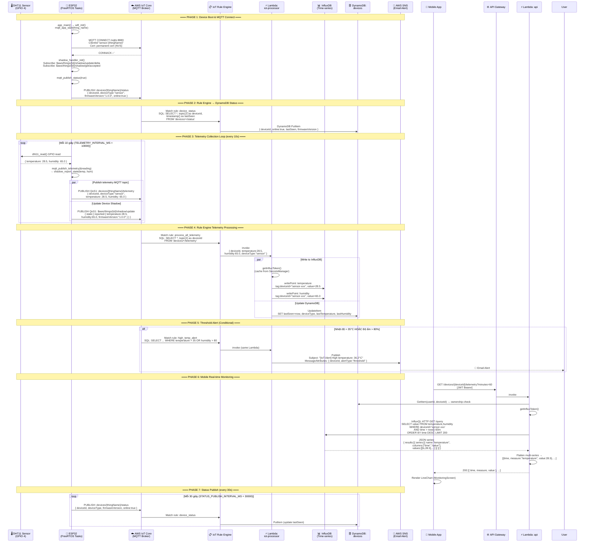

# Luồng 04: Data Collection & Real-time Monitoring (MQTT)

> **Mô tả:** Luồng thu thập dữ liệu telemetry từ cảm biến DHT11 (nhiệt độ/độ ẩm) và luồng monitoring real-time từ mobile app. Bao gồm cả MQTT publish, IoT Rule Engine, InfluxDB time-series, DynamoDB status, và SNS alerts.

---

## Tổng Quan Luồng

```
[DHT11] → [ESP32 Sensor] → MQTT publish →[AWS IoT Core]
                                         → Rule: process_all_telemetry → Lambda IoT Processor
                                                                        → InfluxDB (time-series)
                                                                        → DynamoDB (lastSeen)
                                         → Rule: high_temp_alert (temp>35 OR hum>80)
                                                                        → Lambda IoT Processor
                                                                        → SNS email alert
                                         → Rule: device_status → DynamoDB
[Mobile App] → GET /devices/{id}/telemetry → InfluxDB InfluxQL query → Response
```

---

## Sequence Diagram



---

## MQTT Topics Used

| Topic Pattern | Direction | QoS | Mô tả |
|--------------|-----------|-----|-------|
| `devices/{thingName}/telemetry` | Device → Cloud | 1 | Telemetry nhiệt độ/độ ẩm mỗi 10s |
| `devices/{thingName}/status` | Device → Cloud | 1 | Heartbeat online mỗi 30s |
| `$aws/things/{id}/shadow/update` | Device → Cloud | 1 | Báo cáo trạng thái vào Shadow |
| `$aws/things/{id}/shadow/update/delta` | Cloud → Device | 1 | Cloud muốn device thay đổi |
| `$aws/things/{id}/shadow/get` | Device → Cloud | 1 | Device yêu cầu trạng thái Shadow |
| `$aws/things/{id}/shadow/get/accepted` | Cloud → Device | 1 | Cloud trả về Shadow state |

---

## IoT Rule Engine SQL

```sql
-- Rule 1: Tất cả telemetry → Lambda (store + process)
SELECT *, topic(2) as deviceId
FROM 'devices/+/telemetry'
-- Action: invoke Lambda iot-processor

-- Rule 2: Alert khi vượt ngưỡng → Lambda
SELECT *, topic(2) as deviceId
FROM 'devices/+/telemetry'
WHERE temperature > 35 OR humidity > 80
-- Action: invoke Lambda iot-processor

-- Rule 3: Status → DynamoDB trực tiếp
SELECT *, topic(2) as deviceId, timestamp() as lastSeen
FROM 'devices/+/status'
-- Action: DynamoDB PutItem → devices table
```

---

## InfluxDB Data Model

```
Measurement: temperature
  Tag:   deviceId = "sensor-C3F9A..."
  Field: value    = 28.5 (float)
  Time:  1714000000000 (ms)

Measurement: humidity
  Tag:   deviceId = "sensor-C3F9A..."
  Field: value    = 65.0 (float)
  Time:  1714000000000 (ms)
```

---

## Alert Thresholds

| Metric | Ngưỡng | Action |
|--------|--------|--------|
| `temperature` | > 35°C | SNS → Email alert |
| `humidity` | > 80% | SNS → Email alert |

---

## Source Code References

| File | Vai trò |
|------|---------|
| `device/sensor/src/dht11_driver.c` | GPIO driver đọc DHT11 |
| `device/sensor/src/iot_mqtt_client.c` | `mqtt_publish_telemetry()`, `mqtt_publish_status()` |
| `device/sensor/src/shadow_handler.c` | `shadow_report_state()` |
| `device/sensor/src/main.c` | `telemetry_task()` (10s loop), `status_task()` (30s loop) |
| `device/sensor/src/config.h` | `TELEMETRY_INTERVAL_MS=10000`, `STATUS_PUBLISH_INTERVAL_MS=30000` |
| `backend/functions/iot-processor/handler.js` | Write InfluxDB, update DynamoDB, SNS publish |
| `backend/functions/api/handler.js` | `getTelemetry()` InfluxQL query |
| `infra/modules/iot/iot_core.tf` | Topic rules: `process_all_telemetry`, `high_temp_alert`, `device_status` |
| `mobile/src/screens/MonitoringScreen.jsx` | UI hiển thị chart telemetry |
