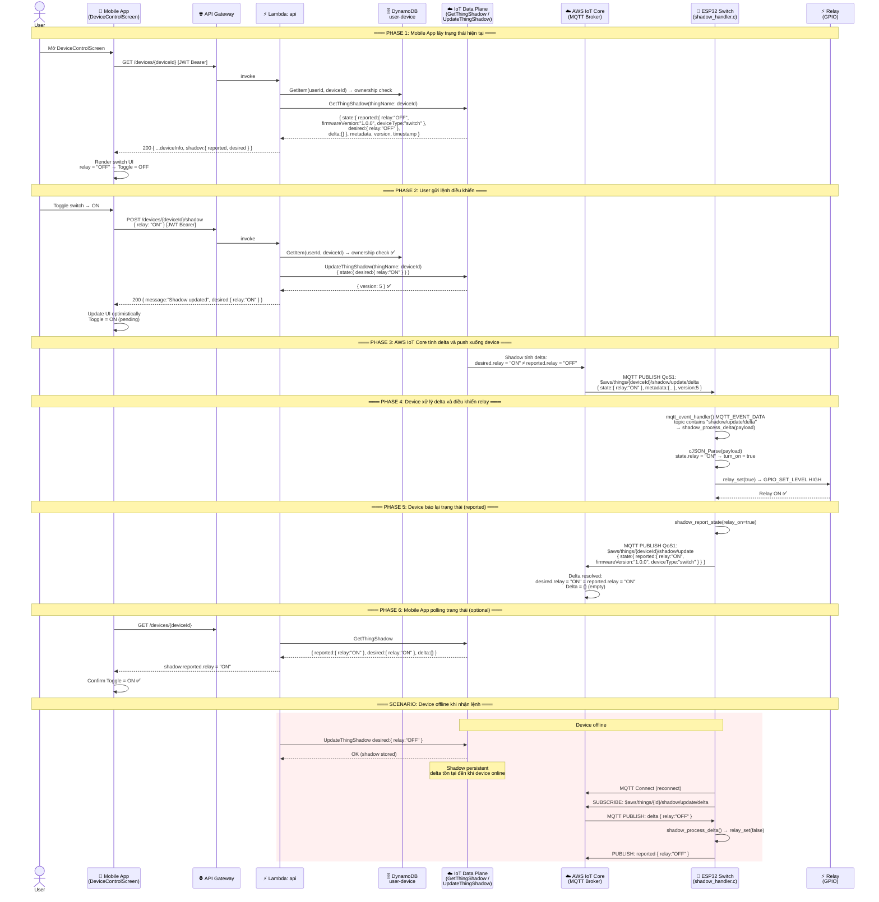

# Luồng 05: Remote Device Control (Shared Attributes / IoT Shadow)

> **Mô tả:** Luồng điều khiển thiết bị từ xa thông qua AWS IoT Device Shadow. Mobile App gửi lệnh (ví dụ: bật/tắt relay) → API Gateway → Lambda → Shadow "desired" → IoT Core delta → ESP32 Device phản hồi relay và báo lại "reported".

---

## Tổng Quan Luồng

```
[Mobile App] → POST /devices/{id}/shadow { relay:"ON" }
→ API Gateway (JWT auth) → Lambda: api
→ IoT Data Plane: UpdateThingShadow { state:{ desired:{ relay:"ON" } } }
→ AWS IoT Core: tính delta (desired ≠ reported)
→ MQTT PUBLISH: $aws/things/{id}/shadow/update/delta { state:{ relay:"ON" } }
→ ESP32 Switch: shadow_process_delta() → relay_set(true)
→ ESP32 Switch: shadow_report_state() → PUBLISH shadow/update { state:{ reported:{ relay:"ON" } } }
→ IoT Core: delta resolved (desired = reported)
```

---

## Sequence Diagram



---

## Shadow Document Structure

```json
// Trạng thái Shadow đầy đủ (GET /devices/{id})
{
  "state": {
    "desired": {
      "relay": "ON"
    },
    "reported": {
      "relay": "ON",
      "firmwareVersion": "1.0.0",
      "deviceType": "switch"
    },
    "delta": {}
  },
  "metadata": {
    "desired": { "relay": { "timestamp": 1714000100 } },
    "reported": { "relay": { "timestamp": 1714000105 } }
  },
  "version": 5,
  "timestamp": 1714000105
}
```

```json
// Delta message khi relay muốn = ON nhưng reported = OFF
{
  "state": {
    "relay": "ON"
  },
  "metadata": {
    "relay": { "timestamp": 1714000100 }
  },
  "version": 5
}
```

---

## MQTT Topics for Shadow

| Topic | QoS | Hướng | Mô tả |
|-------|-----|-------|-------|
| `$aws/things/{id}/shadow/update` | 1 | Device→Cloud | Device publish desired hoặc reported |
| `$aws/things/{id}/shadow/update/accepted` | 1 | Cloud→Device | Shadow update thành công |
| `$aws/things/{id}/shadow/update/rejected` | 1 | Cloud→Device | Shadow update thất bại |
| `$aws/things/{id}/shadow/update/delta` | 1 | Cloud→Device | **Delta: desired ≠ reported** |
| `$aws/things/{id}/shadow/get` | 1 | Device→Cloud | Device yêu cầu shadow hiện tại |
| `$aws/things/{id}/shadow/get/accepted` | 1 | Cloud→Device | Shadow state trả về |

---

## Sensor vs Switch Shadow

| Thiết bị | reported fields | desired fields | delta action |
|----------|----------------|----------------|--------------|
| **Sensor** | temperature, humidity, firmwareVersion, deviceType | (alarm thresholds - future) | Log only (not implemented) |
| **Switch** | relay ("ON"/"OFF"), firmwareVersion, deviceType | relay ("ON"/"OFF") | `relay_set()` → GPIO → `shadow_report_state()` |

---

## API Endpoints

```http
GET /devices/{deviceId}
Authorization: Bearer {Cognito JWT}
→ Returns: { shadow: { state, metadata, version } }

POST /devices/{deviceId}/shadow
Authorization: Bearer {Cognito JWT}
Content-Type: application/json
Body: { "relay": "ON" }
→ UpdateThingShadow: { state: { desired: { relay: "ON" } } }
→ Returns: { message: "Shadow updated", desired: { relay: "ON" } }
```

---

## Source Code References

| File | Vai trò |
|------|---------|
| `device/switch/src/shadow_handler.c` | `shadow_process_delta()` → `relay_set()` → `shadow_report_state()` |
| `device/switch/src/mqtt_client.c` | Subscribe delta, route sang shadow_handler |
| `device/switch/src/relay_control.c` | `relay_set()` GPIO control |
| `device/sensor/src/shadow_handler.c` | `shadow_report_state()` (sensor chỉ report, không control) |
| `device/sensor/src/shadow_handler.h` | `shadow_process_delta()` (no-op for sensor) |
| `backend/functions/api/handler.js` | `getDevice()`, `updateShadow()` |
| `mobile/src/screens/DeviceControlScreen.jsx` | UI toggle, call `updateDeviceShadow()` |
| `mobile/src/services/api.js` | `updateDeviceShadow(id, state)` |
| `infra/modules/iot/iot_core.tf` | IoT Policy: Allow iot:Publish shadow/update, Subscribe shadow/* |
