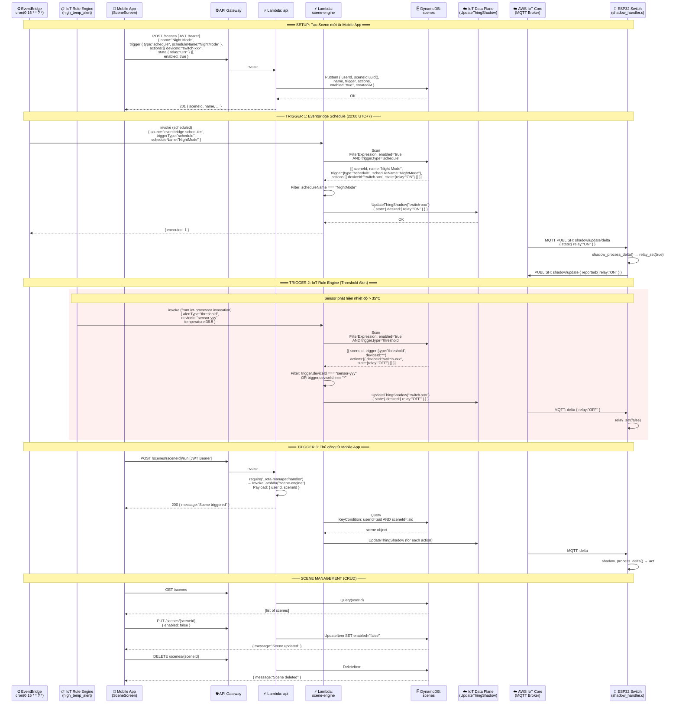

# Luồng 06: Rule Engine & Smart Scene Automation

> **Mô tả:** Luồng tự động hóa thông minh (Smart Scene) kết hợp IoT Rule Engine, Scene Engine Lambda, và Device Shadow. Hỗ trợ 3 loại trigger: lịch (EventBridge), ngưỡng cảm biến (IoT Rule), và thủ công từ app.

---

## Tổng Quan Luồng

```
TRIGGER SOURCES:
1. EventBridge Schedule: cron(0 15 * * ? *) → NightMode @ 22:00 UTC+7
2. IoT Rule Engine: high_temp_alert (temp>35 OR hum>80) → Lambda → SceneEngine
3. Mobile App: POST /scenes/{sceneId}/run → Lambda → SceneEngine

SCENE ENGINE FLOW:
→ Lambda: scene-engine
→ Query DynamoDB scenes table (filter by enabled + triggerType)
→ applyAction(deviceId, state)
→ IoT Data Plane: UpdateThingShadow { state:{ desired: state } }
→ AWS IoT Core: push delta → Device
→ Device: shadow_process_delta() → relay_set() → shadow_report_state()
```

---

## Sequence Diagram



---

## Scene Data Model

```json
// DynamoDB: scenes table
{
  "userId":    "cognito-sub-uuid",
  "sceneId":   "550e8400-e29b-41d4-a716-446655440000",
  "name":      "Night Mode",
  "trigger": {
    "type":         "schedule",
    "scheduleName": "NightMode"
  },
  "actions": [
    {
      "deviceId": "switch-C3F9A...",
      "state": {
        "relay": "ON"
      }
    }
  ],
  "enabled":   "true",
  "createdAt": "2024-04-24T14:00:00.000Z"
}
```

---

## Loại Trigger Hỗ Trợ

| Trigger Type | Nguồn | Condition | Ví dụ |
|-------------|-------|-----------|-------|
| `schedule` | EventBridge cron | `scheduleName` match | NightMode: bật đèn lúc 22:00 |
| `threshold` | IoT Rule → iot-processor → scene-engine | `deviceId` match (or `*`) | Nhiệt độ > 35°C → tắt relay |
| `direct` | POST /scenes/{id}/run | sceneId + userId | User nhấn "Run Now" |

---

## IoT Rule Engine SQL (Liên quan Scene)

```sql
-- Rule: high_temp_alert → Lambda iot-processor
-- (iot-processor có thể invoke scene-engine cho threshold scenes)
SELECT *, topic(2) as deviceId
FROM 'devices/+/telemetry'
WHERE temperature > 35 OR humidity > 80
-- Action: invoke Lambda iot-processor
-- iot-processor → (tùy implementation) invoke scene-engine với alertType:"threshold"
```

---

## EventBridge Rule

```hcl
# Nightly scene @ 22:00 UTC+7 = 15:00 UTC
aws_cloudwatch_event_rule:
  schedule_expression: "cron(0 15 * * ? *)"

# Input payload gửi vào Lambda scene-engine:
{
  "source":       "eventbridge-scheduler",
  "triggerType":  "schedule",
  "scheduleName": "NightMode"
}
```

---

## API Endpoints (Scene CRUD)

```http
GET    /scenes                    → List tất cả scenes của user
POST   /scenes                    → Tạo scene mới
PUT    /scenes/{sceneId}          → Cập nhật scene (name, trigger, actions, enabled)
DELETE /scenes/{sceneId}          → Xóa scene
POST   /scenes/{sceneId}/run      → Chạy scene ngay lập tức
```

---

## Source Code References

| File | Vai trò |
|------|---------|
| `backend/functions/scene-engine/handler.js` | Core: getScenesForTrigger(), executeScene(), applyAction() |
| `backend/functions/api/handler.js` | listScenes(), createScene(), updateScene(), deleteScene(), runScene() |
| `infra/modules/processing/lambda.tf` | EventBridge rule → scene-engine, aws_cloudwatch_event_target |
| `infra/modules/data/dynamodb.tf` | scenes table (userId PK, sceneId SK, enabled GSI) |
| `device/switch/src/shadow_handler.c` | shadow_process_delta() nhận desired state |
| `mobile/src/screens/SceneScreen.jsx` | UI tạo, liệt kê, bật/tắt, chạy scenes |
| `mobile/src/services/api.js` | listScenes(), createScene(), runScene() |
