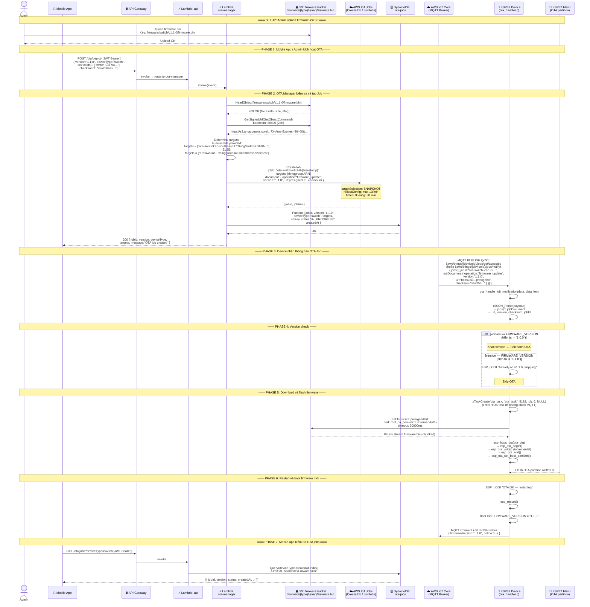

# Luồng 07: Over-The-Air (OTA) Firmware Updates

> **Mô tả:** Luồng cập nhật firmware từ xa cho ESP32 thông qua AWS IoT Jobs + S3 presigned URL. Admin upload firmware lên S3, Lambda tạo IoT Job, device nhận thông báo qua MQTT, download và flash firmware mới, rồi restart.

---

## Tổng Quan Luồng

```
[Admin/Mobile] → POST /ota/deploy { version, deviceType }
→ API Gateway → Lambda: ota-manager
→ S3: verify firmware exists (firmware/{deviceType}/v{version}/firmware.bin)
→ S3: generate presigned URL (24h TTL)
→ AWS IoT Jobs: CreateJob → target ThingGroup hoặc specific Things
→ DynamoDB: record job
→ Device: MQTT $aws/things/{id}/jobs/get/accepted (job notification)
→ Device: ota_handle_job_notification() → parse jobDocument
→ Device: esp_https_ota(presigned URL) → flash new firmware
→ Device: esp_restart() → boot new version
```

---

## Sequence Diagram



---

## Firmware S3 Structure

```
s3://iot-smarthome-firmware/
└── firmware/
    ├── switch/
    │   ├── v1.0.0/
    │   │   └── firmware.bin
    │   └── v1.1.0/
    │       └── firmware.bin
    └── sensor/
        ├── v1.0.0/
        │   └── firmware.bin
        └── v1.1.0/
            └── firmware.bin
```

---

## IoT Job Document Structure

```json
{
  "operation":  "firmware_update",
  "version":    "1.1.0",
  "url":        "https://iot-smarthome-firmware.s3.amazonaws.com/firmware/switch/v1.1.0/firmware.bin?X-Amz-Algorithm=...&X-Amz-Expires=86400",
  "checksum":   "a3f4e5b6c7d8e9f0...",
  "deviceType": "switch"
}
```

---

## OTA Job Configuration

| Parameter | Value | Mô tả |
|-----------|-------|-------|
| `targetSelection` | `SNAPSHOT` | Job chỉ áp dụng cho devices hiện tại trong group |
| `maximumPerMinute` | 10 | Rollout tối đa 10 device/phút (tránh overload) |
| `inProgressTimeoutInMinutes` | 30 | Timeout mỗi device: 30 phút |
| Presigned URL TTL | 86400s (24h) | URL hết hạn sau 24h |

---

## ESP32 OTA Partition Layout

```
ESP32 Flash (4MB default):
┌─────────────────┬──────────────────┐
│ bootloader      │ 0x1000           │
│ partition_table │ 0x8000           │
│ nvs             │ 0x9000  (16KB)   │
│ ota_0 (active)  │ 0x10000 (1.5MB)  │
│ ota_1 (update)  │ 0x1A0000 (1.5MB) │
└─────────────────┴──────────────────┘

esp_https_ota():
1. esp_ota_begin(ota_1) → ghi vào partition không active
2. esp_ota_write() × N → stream firmware.bin
3. esp_ota_end() → finalize
4. esp_ota_set_boot_partition(ota_1) → set boot pointer
5. esp_restart() → boot từ ota_1
6. On next boot: ota_1 becomes active (ota_0 = backup)
```

---

## Sensor vs Switch OTA Differences

| Aspect | Switch (`ota_handler.c`) | Sensor (`ota_handler.c`) |
|--------|--------------------------|--------------------------|
| checksum field | ✅ Hỗ trợ (lưu vào job struct) | ❌ Không có |
| jobId field | ✅ Lưu vào job struct | ❌ Không có |
| mbedtls SHA256 | ✅ Include (future verification) | ❌ Không include |
| Logic | Giống nhau: version check → xTaskCreate(ota_task) | Giống nhau |

---

## API Endpoints

```http
POST /ota/deploy
Authorization: Bearer {Cognito JWT}
Content-Type: application/json
Body: {
  "version":    "1.1.0",
  "deviceType": "switch",
  "deviceIds":  ["switch-C3F9A..."],  // optional, bỏ = target cả group
  "checksum":   "sha256hex..."         // optional
}
→ Returns: { jobId, version, deviceType, targets }

GET /ota/jobs?deviceType=switch
Authorization: Bearer {Cognito JWT}
→ Returns: [{ jobId, version, status, createdAt, targets, s3Key }]
```

---

## Source Code References

| File | Vai trò |
|------|---------|
| `device/switch/src/ota_handler.c` | `ota_handle_job_notification()`, `ota_task()` (đầy đủ: jobId, checksum) |
| `device/sensor/src/ota_handler.c` | `ota_handle_job_notification()`, `ota_task()` (cơ bản) |
| `device/switch/src/mqtt_client.c` | Subscribe `$aws/things/{id}/jobs/*`, route sang ota_handler |
| `device/sensor/src/iot_mqtt_client.c` | Subscribe jobs topics, handle OTA notification |
| `backend/functions/ota-manager/handler.js` | `firmwareKey()`, S3 HeadObject, GetSignedUrl, CreateJob |
| `backend/functions/api/handler.js` | `listOtaJobs()`, route POST /ota/deploy → ota-manager |
| `infra/modules/ota/s3_firmware.tf` | S3 bucket cho firmware |
| `infra/modules/data/dynamodb.tf` | ota-jobs table (jobId PK, deviceType-createdAt GSI) |
| `infra/modules/processing/lambda.tf` | Lambda ota-manager, S3 permissions, IoTCore permissions |
| `mobile/src/services/api.js` | `deployOta()`, `listOtaJobs()` |
