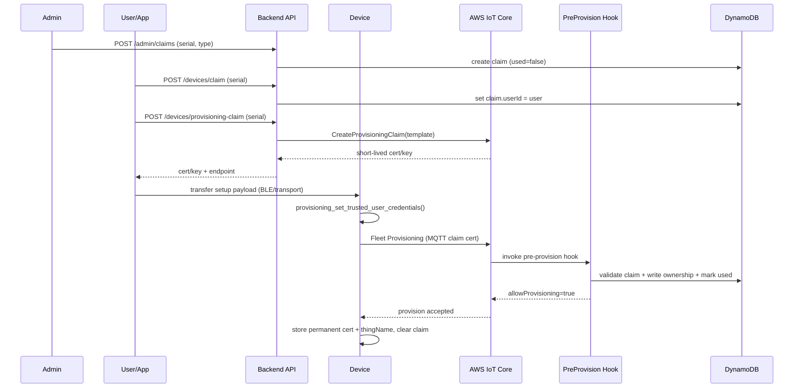

# Co che provisioning va ownership thiet bi (theo code hien tai)

Tai lieu nay mo ta luong thuc te trong code cua repo, tap trung vao switch (sensor tuong tu).

## 1) Thanh phan lien quan

- Firmware:
  - device/switch/src/main.c
  - device/switch/src/provisioning.c
  - device/switch/src/provisioning.h
- Backend:
  - backend/functions/api/handler.js
  - backend/functions/provisioning-hook/handler.js
- Mobile:
  - mobile/src/services/api.js
  - mobile/src/services/ble.js
- Infra (Terraform):
  - infra/modules/provisioning/fleet_provisioning.tf
  - infra/modules/data/dynamodb.tf

## 2) Cac bang du lieu va y nghia ownership

- device_claims (${project}-device-claims):
  - claimId = serialNumber (ma in tren thiet bi/QR)
  - deviceType, used, userId, claimedAt, usedAt, thingName...
  - Day la nguon su that cho qua trinh "ai dang duoc phep provision".

- user_device_mapping (${project}-user-device):
  - PK: userId, SK: deviceId
  - Luu quan he so huu user <-> device sau provisioning thanh cong.

- devices (${project}-devices):
  - PK: deviceId
  - Registry metadata (ownerId, firmware, status, lastSeen...).

## 3) Luong end-to-end

### B1. Admin tao claim token

API: POST /admin/claims

- backend/functions/api/handler.js -> adminRegisterClaim()
- Tao ban ghi trong device_claims voi:
  - claimId = serialNumber
  - used = false
  - deviceType

### B2. User claim thiet bi tren app

API: POST /devices/claim

- backend/functions/api/handler.js -> claimDevice(serialNumber, userId)
- Dieu kien bat buoc:
  - claim ton tai
  - chua co userId
  - used = false
- Neu dat dieu kien: set userId + claimedAt vao device_claims.

Y nghia: ownership tam thoi duoc gan vao claim truoc khi thiet bi provision.

### B3. User xin bo claim cert ngan han de setup

API: POST /devices/provisioning-claim

- backend/functions/api/handler.js -> postProvisioningClaim(serialNumber, userId)
- Kiem tra:
  - claim ton tai
  - claim chua used
  - claim.userId phai trung user dang dang nhap
- Goi AWS IoT CreateProvisioningClaim(templateName) va tra ve:
  - certificatePem
  - privateKey
  - certificateId
  - expiration
  - iotDataEndpoint

Template duoc chon theo deviceType:
- switch -> {project}-SwitchTemplate
- sensor -> {project}-SensorTemplate

### B4. App chuyen payload setup xuong thiet bi

- mobile/src/services/ble.js co buildDeviceSetupPayload(...)
- Payload gom WiFi + provisioning cert/key + endpoint

Luu y hien trang:
- sendDeviceSetupOverBle(...) dang throw "BLE not configured".
- Nghia la app da co payload format, nhung duong gui BLE chua duoc wiring.

### B5. Firmware luu Trusted User claim vao NVS

Ham: provisioning_set_trusted_user_credentials(...) trong provisioning.c

- Luu vao NVS:
  - claim_cert
  - claim_key
  - iot_host

### B6. First boot: firmware chay provisioning

- main.c:
  - neu !provisioning_is_done() -> goi provisioning_run()
- provisioning_run() trong provisioning.c:
  1. Doc claim cert/key tu NVS
  2. Ket noi MQTT bang claim cert
  3. Publish $aws/certificates/create/json
  4. Nhan accepted va lay cert moi
  5. Publish den topic template:
     $aws/provisioning-templates/{template}/provision/json

Payload gui template bao gom:
- certificateOwnershipToken
- parameters.SerialNumber
- parameters.DeviceType
- parameters.FirmwareVersion

SerialNumber hien tai duoc firmware tao tu MAC WiFi STA (12 ky tu hex in hoa).

### B7. AWS IoT goi Pre-Provisioning Hook

- backend/functions/provisioning-hook/handler.js
- Hook xac thuc:
  1. serial ton tai trong device_claims
  2. claim chua used
  3. claim da co userId (bat buoc user claim truoc)
- Neu hop le, hook se:
  - Ghi user_device_mapping (gan userId <-> thingName)
  - Ghi devices registry (ownerId = claim.userId)
  - Danh dau claim used = true
- Tra allowProvisioning: true cho AWS IoT.

=> Day la diem chot ownership chinh thuc trong he thong.

### B8. Firmware chot provision va chay binh thuong

Sau khi provision thanh cong, firmware:
- Luu cert/permanent key/thing_name vao NVS
- Set provisioned = 1
- Xoa claim cert/key tam thoi khoi NVS
- Restart

Tu lan boot sau:
- Khong chay provisioning nua
- MQTT ket noi bang permanent cert.

## 4) Ownership duoc enforce o dau

1. Luc claim:
- /devices/claim khong cho claim neu da co owner hoac da used.

2. Luc provisioning:
- Hook bat buoc claim phai co userId va chua used.
- Hook moi la noi tao mapping user-device va ownerId.

3. Luc runtime API:
- /devices/:id, /devices/:id/shadow, /devices/:id/telemetry
  deu check user_device_mapping truoc khi cho phep.

## 5) Sequence ngan gon

## 6) Cac diem can biet khi van hanh

- SerialNumber phai khop voi cach firmware tao serial tu MAC; neu QR serial khong khop, hook se reject.
- Thoi gian hieu luc claim cert la ngan (CreateProvisioningClaim), can gui setup xuong thiet bi trong cua so nay.
- mobile/src/services/ble.js hien chua implement transport thuc te, nen can co kenh khac hoac bo sung BLE GATT de goi duoc provisioning_set_trusted_user_credentials().

## 7) Ket luan

Ownership cua thiet bi duoc xac lap theo 2 pha:
- Pha 1 (user claim): gan user vao claim token serial.
- Pha 2 (pre-provision hook): xac thuc claim va ghi mapping user-device + ownerId khi IoT cho phep tao Thing.

Do do, thiet bi chi duoc provision cho user da claim serial truoc, va cac API runtime tiep tuc enforce theo user_device_mapping.
